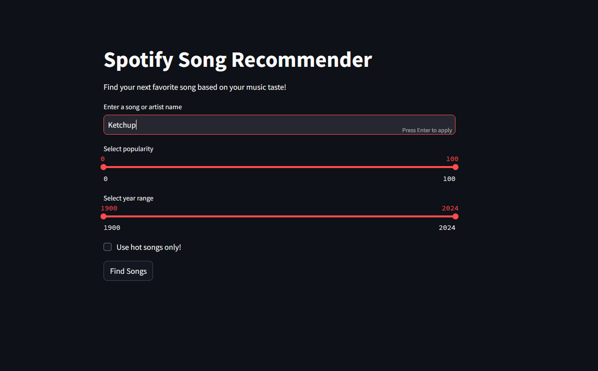
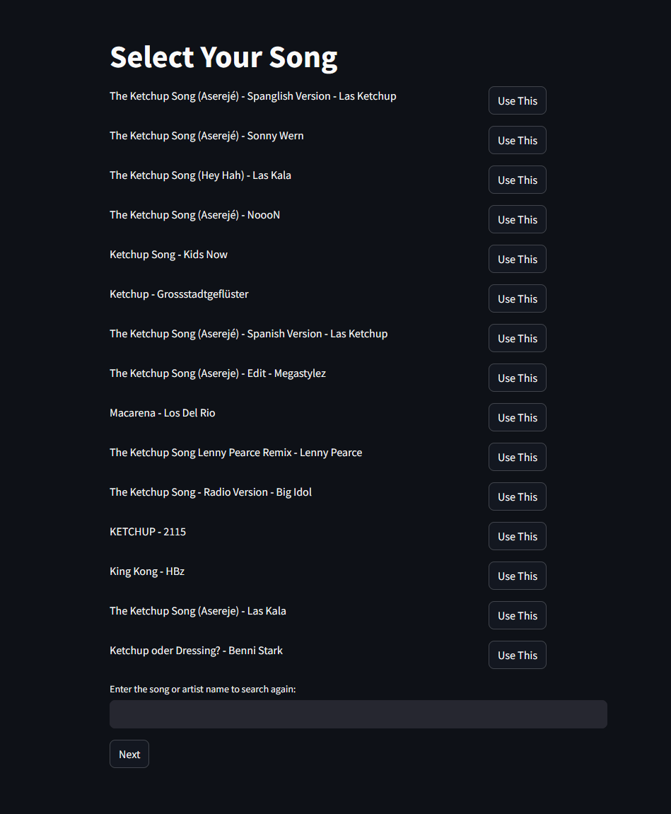
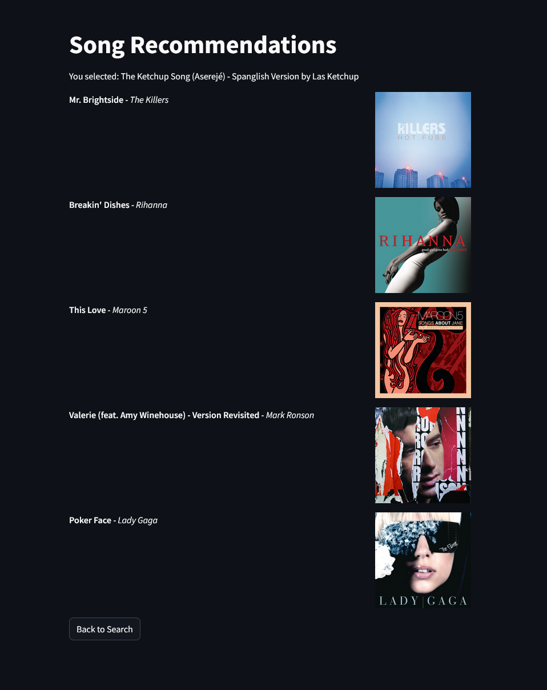
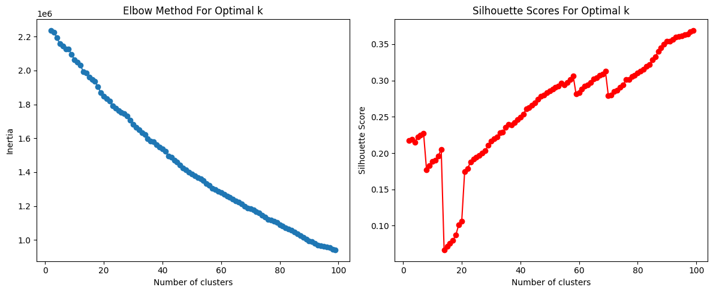

# 🎶 Spotify Song Recommender


## Summary
The Spotify Song Recommender is an interactive web application designed to help users discover new music based on their preferences. By leveraging the Spotify API, the app allows users to search for songs or artists, filter results based on popularity and release year, and receive personalized song recommendations. The underlying recommendation system utilizes clustering algorithms to analyze song features and provide tailored suggestions. This project not only enhances the music discovery experience but also showcases the power of data science in the music industry.


 
 
 


## Link to Deployed App
[Visit the Spotify Song Recommender](https://spotifysong-recommender-beta.streamlit.app/)

## Resources
- **Spotify API**: [Spotify Developer](https://developer.spotify.com/documentation/web-api/)
- **Million Song Dataset (Subset)**: [Million Song Dataset](http://millionsongdataset.com/)

## Model Used and Evaluation
The recommendation system employs a KMeans clustering model to group similar songs based on their features. The model's performance was evaluated using Silhouette and Elbow methods, which helped determine the optimal number of clusters for effective recommendations.

### Silhouette and Elbow Charts


**Conclusion**: The analysis indicates that the chosen number of clusters effectively captures the diversity of songs, leading to meaningful recommendations.

## Repo Structure
``` 
SpotipySongRecommender_practise/
├── app/
│   ├── recommender_app.py
│   ├── allinone_app.py
├── notebooks/
│   ├── separate notebooks for each step of the project
├── data/
│   ├── separate .csv files for each step of the project
├── README.md
├── requirements.txt
├── models/
│   ├── kmeans_model.pkl
│   ├── dbscan_model.pkl
├── scaler/
│   ├── spotify_scaler.pkl
├── stills/
│   ├── stills for the readme as well as quick overview of charts and plots
├── wireframes/
│   ├── wireframe for the app


```

## Steps to Run the App Locally
1. **Clone the Repository**
   ```bash
   git clone https://github.com/howtotrainyourDA/SpotipySongRecommender_practise
   cd SpotipySongRecommender_practise
   ```

2. **Install Requirements**
   ```bash
   pip install -r requirements.txt
   ```

3. **Update Environment Variables**
   - Create a `.env` file in the root directory and add your Spotify API credentials:
     ```
     SPOTIPY_CLIENT_ID=your_client_id
     SPOTIPY_CLIENT_SECRET=your_client_secret
     ```

4. **Run the App**
   ```bash
   streamlit run app/recommender_app.py
   ```

Enjoy discovering new music with the Spotify Song Recommender!